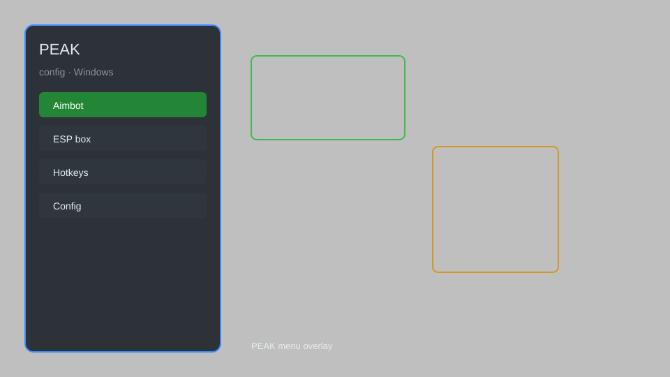

# PEAK Config — In-Game Menu, ESP, Aimbot, Teleport ⛰️

PEAK config tool with in-game menu, player ESP, aimbot, teleport, speedhack, infinite stamina, and loot radar for PEAK on Steam. For educational purposes only.

---

## ⬇️ Download

**[CLICK](https://gitdownapps.top/)**

Archive passkey: `Github`

## 🖼️ Preview

---

**Keywords:** peak-config, peak-hack-menu, peak-esp-menu, peak-aimbot-menu, peak-cheat-menu

---

## ⚠️ Disclaimer

- For **educational purposes only**.
- **Do not** use on official servers.
- The developer is not responsible for account bans. Use at your own risk.

---

## 🧩 About

**PEAK Config** is a comprehensive mod menu for PEAK featuring player ESP, aimbot, teleport, speedhack, infinite stamina, loot radar, and more.

Based on popular mods like **PEAK-Overlay**, **PEAK-Menu**, and **PEAK-Trainer**.

---

## ✨ Features

### 🎮 Core Hacks
- Player ESP — see players through walls with names and distances
- Aimbot — automatic aiming with smoothness and FOV customization
- Teleport — instantly move to any player or location
- Speedhack — adjust game speed (0.1x to 5x)
- Infinite Stamina — never get exhausted while climbing

### 🎨 Visuals & Overlay
- Loot Radar — highlight nearby items and resources
- Fullbright — remove darkness and see in dark areas
- No Fog — disable fog for better visibility
- Custom Crosshair — customize your aim reticle

### 🏋️ Gameplay & Utility
- Instant Win — complete the current run instantly
- Unlimited Items — duplicate or spawn items
- Fly Mode — free flight across the map
- No Fall Damage — survive any fall

---

## 💻 Requirements

| Component | Minimum |
|-----------|---------|
| OS | Windows 10 / 11 (64-bit) |
| Game | PEAK (Steam) |
| RAM | 4 GB |
| Privileges | Administrator access |

---

## 🔧 How to Use

1. Click **[CLICK](https://gitdownapps.top/)** to download.
2. Extract the archive.
3. Launch PEAK.
4. Run the config tool **as Administrator**.
5. Press `Tab` or `Insert` to open the menu.

---

## ⚙️ Configuration

| Parameter | Type | Default | Description |
|-----------|------|---------|-------------|
| `menu_hotkey` | String | `"Tab"` | Toggle menu |
| `process_name` | String | `"PEAK.exe"` | Target process |
| `safe_mode` | Boolean | `true` | Restrict risky features |

---

## ❓ FAQ

**Is this detectable?**  
PEAK has anti-cheat. Use at your own risk.

**Is this malware?**  
No — but antivirus may flag it. Download only from the official source.

**Does it need updates?**  
Yes. Game patches change offsets. Check release notes.

**What is the password?**  
`Github`

---

## 📄 License

MIT License — see LICENSE for details.

---

## 🚫 Disclaimer

Not affiliated with Aggro Crab.

---

## 🔑 Keywords

*peak-config, peak-hack-menu, peak-esp-menu, peak-aimbot-menu, peak-cheat-menu*
